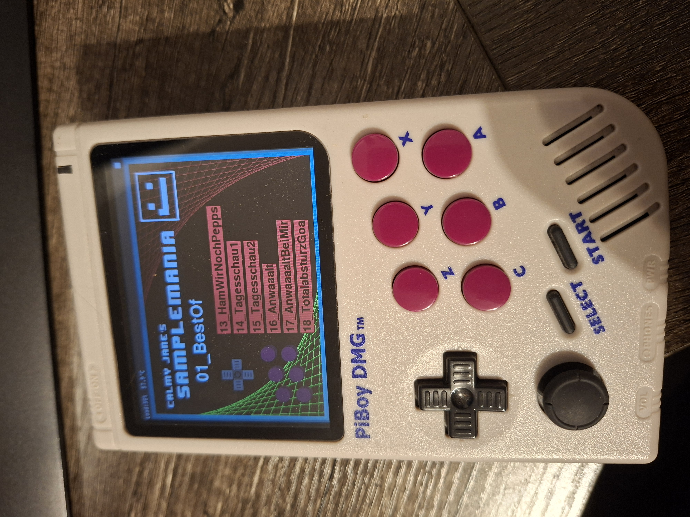

# Samplemania (and other stuff)

## Overview

This Repo contains some python tools that can be run on a PiBoy DMG, a raspberry-based gameboy emulator.

The tools are not games, but musical apps.

## Samplemania

This app is the main tool currently, it plays back samples (16bit mono wav) that are copied to the piboys memory (RetroPie/Files/Samples). It's not a musical sampler with sequencer functionality, but main focus is to quickly navigate a big sample library, playing back different samples on one of the 6 buttons of the piboy.

## How to run this

To run this code, you need to register python files as plugins.

Step by Step setup:

Setup your PiBoy DMG as described here: https://resources.experimentalpi.com/the-complete-piboy-dmg-getting-started-guide/
Connect PiBoy to your Wifi: https://resources.experimentalpi.com/piboy-dmg-wifi-setup/
Connect to your PiBoy DMG by typing \retropie in your Explorer while the device is turned on an connected to wifi
Add some ROMs for testing, you can find them on google ;)
Add a new "System" to your EmulationStation, this is a new type of ROMs you want to load, make the file type ".py" and the command "sudo python3 %ROM%": https://retropie.org.uk/docs/Add-a-New-System-in-EmulationStation/ You can basically also add all kind of files or direct shell script this way. Be aware, that this as always is a security risk ;)
Add the python file from this repo to the folder you specified for the system on \retropie
Start your PiBoy and in EmulationStation instread of "GameBoy" or "GameBoy Color" select "python" and select Samplemania
I hope you find other ways to play around here, this was a really fun project, and can potentially be used to develop custom games for the PiBoy as well :D