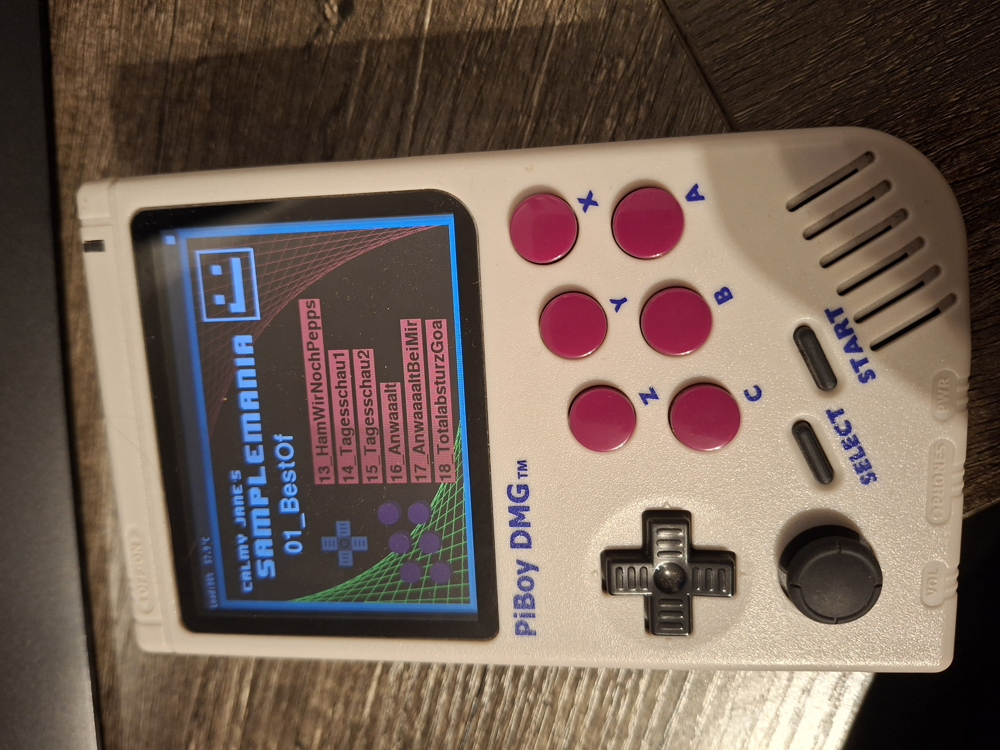

# Samplemania (and other stuff)

## Overview

This Repo contains some python tools that can be run on a PiBoy DMG, a raspberry-based gameboy emulator.

The tools are not games, but musical apps.

## Samplemania

This app is the main tool currently, it plays back samples (16bit mono wav) that are copied to the piboys memory (RetroPie/Files/Samples). It's not a musical sampler with sequencer functionality, but main focus is to quickly navigate a big sample library, playing back different samples on one of the 6 buttons of the piboy.

## How to run this

To run this code, you need to register python files as plugins.

Step by Step setup:

Setup your PiBoy DMG as described here: https://resources.experimentalpi.com/the-complete-piboy-dmg-getting-started-guide/
Connect PiBoy to your Wifi: https://resources.experimentalpi.com/piboy-dmg-wifi-setup/
Connect to your PiBoy DMG by typing \retropie in your Explorer while the device is turned on an connected to wifi
Add some ROMs for testing, you can find them on google ;)
Add a new "System" to your EmulationStation, this is a new type of ROMs you want to load, make the file type ".py" and the command "sudo python3 %ROM%": https://retropie.org.uk/docs/Add-a-New-System-in-EmulationStation/ You can basically also add all kind of files or direct shell script this way. Be aware, that this as always is a security risk ;)
Add the python file from this repo to the folder you specified for the system on \retropie
Start your PiBoy and in EmulationStation instread of "GameBoy" or "GameBoy Color" select "python" and select Samplemania
I hope you find other ways to play around here, this was a really fun project, and can potentially be used to develop custom games for the PiBoy as well :D
## Recording

Samplemania can record from a USB microphone and drop the takes straight into
the library as a preset called `Recordings`.

Press **START** in the play screen to reach the record screen:

| Button | Action |
| --- | --- |
| Z | start / stop recording |
| UP / DOWN | pick a take from the list |
| A | preview the picked take |
| SELECT | delete the picked take (asks first) |
| B | cancel the delete |
| START | back to the play screen |
| START + SELECT | quit |

Takes are listed newest first, so the one you just recorded is already
selected - but any take in the folder can be picked and deleted, not only the
last one. Deleting removes the raw original along with it.

On stop the take is written twice: the untouched original to
`Recordings/.raw/`, and an auto-trimmed copy to `Recordings/` which is what
plays back. The trim estimates the room's noise floor from the take itself, so
it still finds the start of a word in a loud room; if nothing rises above the
floor the full take is kept instead. The raw file is never modified, so a bad
trim can always be redone from it.

The trimmed copy is also peak normalised to -3dBFS, because USB mics record
far too quietly to sit next to the rest of the library. `NORMALIZE`,
`TARGET_PEAK_DBFS` and `MAX_GAIN_DB` in `config.py` control that; the 30dB gain
cap stops a take of pure room noise being lifted into a wall of hiss. If takes
are still quiet, the mic's own capture level is the thing to raise - run
`alsamixer`, press F6 to pick the USB card, F4 for capture, and turn it up
(plus `Mic Boost` if the card has one). `RECORD_GAIN` in `config.py` is the
last resort, applied before the trim detector, for a mic with no usable gain
control of its own.

### Setup

    sudo apt install libportaudio2 python3-cffi python3-numpy python3-pip
    sudo pip3 install sounddevice

`python3-sounddevice` is not in the RetroPie repos, hence pip. Install it with
`sudo` rather than `--user`: EmulationStation launches the app as root, and
root does not read `~/.local`.

Then check the mic is seen and producing level:

    python3 /home/pi/RetroPie/roms/python/check_audio.py

If it picks the wrong device, set `INPUT_DEVICE` in `config.py` to the device
index or a piece of its name.

A dynamic handheld mic (e.g. Samson Q2U) works far better than a condenser at a
party - it rejects the room instead of recording all of it.
